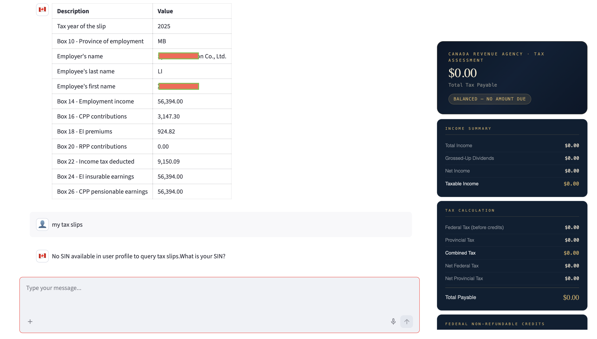

# Canada TAX AI Assistant

Canada TAX AI Assistant is an AI-powered, conversational, and user-friendly tax filing assistant designed for individuals in Canada. The platform helps users understand, organize, and complete their personal tax returns through natural language interaction and intelligent guidance.

By combining artificial intelligence with a simple chat-based experience, the assistant can help users collect tax information, explain tax concepts, identify eligible deductions and credits, and guide them through the tax filing process efficiently and accurately.

The project is designed to make personal tax filing more accessible, less stressful, and easier for everyday users, including newcomers, workers, students, and families in Canada.

---

## Core Application Layer

- **Streamlit (UI Layer)**  
  Provides a simple, interactive web interface for users to upload tax documents, chat with the assistant, and generate reports.

- **Python 3.10+ Backend**  
  Core business logic, AI orchestration, and data processing pipelines are implemented in Python.

---

## AI & LLM Stack

- **LangGraph**  
  Used to build structured multi-step AI workflows such as:
  - Tax document understanding pipeline
  - Conversation state management
  - Multi-agent reasoning flows

- **LangChain + LangChain Community**  
  Provides tool calling, prompt orchestration, memory handling, and integration with external APIs.

- **LangChain Groq**  
  Connects to high-performance LLM inference (Groq API) for fast conversational responses.

- **Sentence Transformers**  
  Used for embedding generation in semantic search and document similarity matching.

---

## RAG (Retrieval-Augmented Generation) System

- **ChromaDB** + **LangChain Chroma**  
  Vector database used for:
  - Storing tax knowledge base
  - Embedding user documents (T4, T5, receipts)
  - Semantic retrieval for context-aware responses

- Enables intelligent tax Q&A grounded in Canadian tax rules and user documents.

---

## Document Intelligence & OCR Pipeline

- **pytesseract** + **pdf2image** + **opencv-python-headless**  
  Used for OCR processing of scanned documents:
  - Extract text from T4/T5 slips
  - Preprocess images for better recognition
  - Convert PDF pages into images for OCR

- **pdfplumber**  
  Extract structured data from digital PDFs.

- **Pillow (PIL)**  
  Image processing and format handling.

---

## Data & Backend Services

- **Supabase**  
  Backend-as-a-service for:
  - User authentication
  - Cloud database storage
  - File storage (tax documents, reports)

- **Pydantic**  
  Data validation and structured schema definitions for tax forms and AI outputs.

---

## Key System Capabilities

- Conversational AI tax assistant powered by LLMs
- Automated T4 / T5 document extraction using OCR + parsing pipeline
- RAG-based tax knowledge retrieval system
- Multi-step workflow orchestration via LangGraph
- Secure user data storage with Supabase
- Semantic search over tax documents using embeddings
---

# AI Capabilities

- Natural language conversation and tax guidance
- Intelligent tax document parsing and classification
- Multi-step workflow orchestration for tax filing processes
- Personalized tax deduction and credit recommendations
- Context-aware memory and user interaction management

---

# Key Features

- Conversational tax assistant
- AI-powered tax form analysis
- Automated data extraction
- Personal tax filing guidance
- User-friendly workflow for Canadian tax scenarios
- Secure and privacy-focused system design

# How to run
#Mac OS 
python3 -m venv venv 

source venv/bin/activate 

pip install -e . 

cp .env.example .env 

streamlit run src/app.py 

# DEMO
